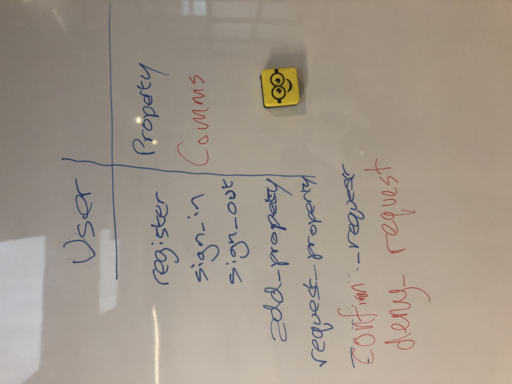
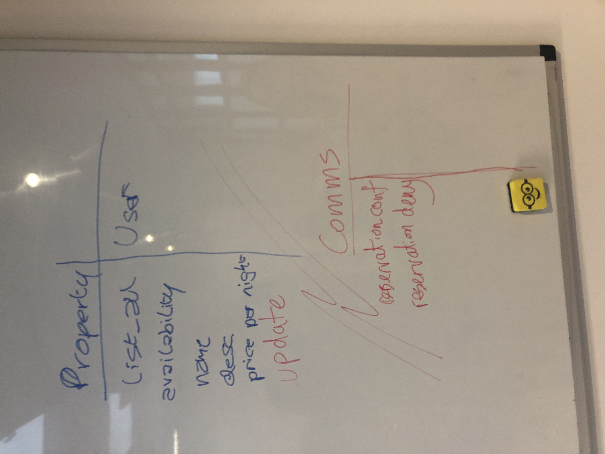

# Makers BnB #

## Description ##

[DESCRIPTION GOES HERE]

## Specification ##

Headline specifications:
* Any signed-up user can list a new space.
* Users can list multiple spaces.
* Users should be able to name their space, provide a short description of the space, and a price per night.
* Users should be able to offer a range of dates where their space is available.
* Any signed-up user can request to hire any space for one night, and this should be approved by the user that owns that space.
* Nights for which a space has already been booked should not be available for users to book that space.
* Until a user has confirmed a booking request, that space can still be booked for that night.

## User Stories ##

1.
```
As a user
So I can use the website
I'd like to be able to sign up for an account
```
2.
```
As a user
So I can list properties
I'd like to be able to list spaces for rent
```
3.
```
As a user
When listing a space
I'd like to to specify name, description and price per night
```
4.
```
As a user
So that people can book my space
I'd like to specify when it is available
```
5.
```
As a user
So I can hire a space
I'd like to request the space for the night I want it
```
6.
```
As a user
So I can rent my space
I'd like to be able to approve user requests
```
7.
```
As a user
So that a space is not double booked
I would like to prevent the space being requested when it has already been booked
```
8.
```
As a user
If a space has been requested but not confirmed,
I would like to be able to request it too.
```

## Technologies

* JavaScript
* jQuery
* Jasmine
* Sinatra
* (Ruby)
* PG
* PostgreSQL
* HTML
* CSS
* Bootstrap

## Minimum Viable Product ##

By Tuesday:

`A functioning web application where users can register an account and list properties to rent, which are stored in a database.`

By Friday:

`All user stories completed.`

## Stand Ups and Retro Schedule ##

Daily:

`Stand Up @ 10am`

`Retro @ 4pm`

## Pairing Patterns ##

Tuesday AM `(Lucas/Aimee, Mel/Prash)`

Tuesday PM `(Lucas/Mel, Aimee/Prash)`

Wednesday AM `(Mel/Aimee, Lucas/Prash)`

Wednesday PM `(Lucas/Aimee, Mel/Prash)`

Thursday AM `(Lucas/Mel, Aimee/Prash)`

Thursday PM `(Mel/Aimee, Lucas/Prash)`

## CRC Cards ##



## Database Plan ##


## MVC Plan ##


test
